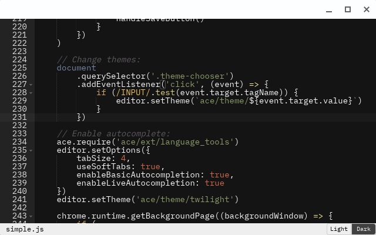
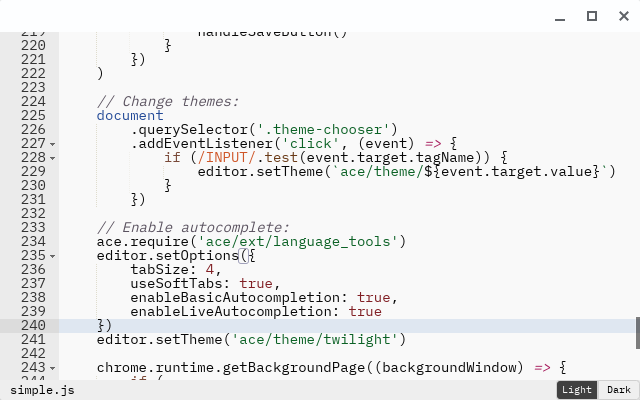

# Simple

A back to basics code editor. It originally used CodeMirror, but switched to Ace.

## Keyboard shorcuts:

**New**:
<kbd>Ctrl</kbd> + <kbd>N</kbd>
_OR_
<kbd>Cmd</kbd> + <kbd>N</kbd>

**Open**:
<kbd>Ctrl</kbd> + <kbd>O</kbd>
_OR_
<kbd>Cmd</kbd> + <kbd>O</kbd>

**Save**:
<kbd>Ctrl</kbd> + <kbd>S</kbd>
_OR_
<kbd>Cmd</kbd> + <kbd>S</kbd>

**Find**:
<kbd>Ctrl</kbd> + <kbd>F</kbd>
_OR_
<kbd>Cmd</kbd> + <kbd>F</kbd>

The other shortcuts are analogous to most modern non-modal editors, try stuff out!

### This project uses:

